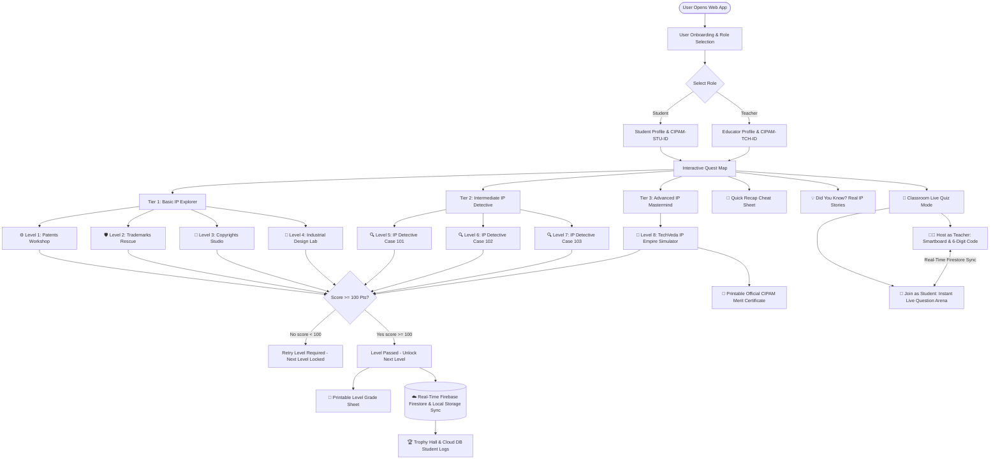

# 🚀 CIPAM IP Quest: Gamified Intellectual Property Awareness for School Students

[](https://sih.gov.in)
[-amber.svg)](https://cipam.gov.in)
[](https://sih.gov.in)
[](#)
[](https://cipam-ai-quest.vercel.app)

---

## 📌 Problem Statement Overview (SIH1384)

- **Problem ID**: SIH1384
- **Title**: Developing an interactive gaming software / mobile application on Intellectual Property Awareness for school students.
- **Category**: Smart Education / Software
- **Nodal Ministry / Organization**: Cell for IPR Promotion and Management (CIPAM), Department for Promotion of Industry and Internal Trade (DPIIT), **Ministry of Commerce and Industry, Government of India**.

### 🎯 The Challenge
One of the primary objectives of CIPAM is to create educational tools and resources for **Intellectual Property Rights (IPR)** awareness at the school level. School students learn best when technical areas of law are **gamified, interactive, and visually driven**. Plain text and long legal sentences fail to engage young minds.

### 💡 Our Solution
**CIPAM IP Quest** is an interactive, gamified learning web application that turns complex IPR law into engaging story-driven quests, visual sorting minigames, RPG detective case files, and startup simulation challenges across 3 progression tiers: **Basic, Intermediate, and Advanced**.

Featuring **Real-Time Database Sync (Firebase Cloud Firestore)**, **Live Mobile Classroom Quiz Arena**, **Printable Level Grade Sheets**, and **Official CIPAM Merit Certificate Generation**!

🔗 **Live Application URL**: [https://cipam-ai-quest.vercel.app](https://cipam-ai-quest.vercel.app)

---

## 🎯 Key Features & Solved Challenges

1. **Eliminates Legal Jargon Wall-of-Text**: Replaces legal clauses with interactive conveyor belt sorters, logo inspectors, and RPG courtroom trials.
2. **Covers Core 4 IP Pillars**: Teaches **Patents**, **Trademarks**, **Copyrights**, and **Industrial Designs** with real-world Indian & global examples.
3. **Minimum Level Passing Criteria (100 Pts / 1 Star)**: Students must score at least 100 points (1 Star) on a level to pass and unlock the next level. Scoring 0 points forces a level retry.
4. **Separate Level Grade Sheets & Final Merit Certificate**:
   - 📜 **Level Grade Sheets**: Printable individual report cards available after passing any level (showing score, stars, accuracy %, date, and verification code).
   - 🏆 **Official Merit Certificate**: Locked until the student completes **Level 8: Startup Simulator**.
5. **Dual-Role Live Classroom Quiz Mode**: Enables teacher-projector hosting via 6-digit room codes alongside real-time student mobile phone participation, live answer syncing, and a real-time smartboard leaderboard.
6. **Student & Teacher Role-Aware Identity**: Collects user details (Name, Class 6-12 / Educator Designation, School, Avatar) generating unique `CIPAM-STU-XXXXX` or `CIPAM-TCH-XXXXX` IDs.
7. **Randomized Final Level Answer Patterns**: Option choices in the final level are shuffled dynamically using Fisher-Yates algorithm to prevent predictable repeating answer patterns.
8. **Refresh Persistence & Session Logout**: User progress persists seamlessly across browser refreshes (`localStorage`), and header includes a dedicated **Log Out** button to switch profiles.

---

## 🏗️ System Architecture & Workflow

### 🔄 Application Flowchart



---

## 🎮 Core Quests & Game Modules

### Tier 1: Basic (IP Explorer)
- ⚙️ **Level 1: Patents Workshop**: Help young inventor Alex evaluate novel inventions on a high-tech conveyor belt based on **Novelty**, **Inventive Step**, and **Industrial Use**.
- 🛡️ **Level 2: Brand Guardian Quest**: Spot genuine trademarks vs counterfeit fake products (e.g. *Abibas*, *Pumaa*), and differentiate ™ (pending) from ® (registered).
- 🎨 **Level 3: Creator's Studio**: Help artist Maya protect digital paintings, music, books, and code. Resolve **Fair Use** vs **Piracy** scenarios.
- 📐 **Level 4: Product Design Lab**: Learn how **Industrial Design** registration protects 3D visual aesthetic shape and casing contours without patenting internal technical mechanisms.

### Tier 2: Intermediate (IP Detective RPG Cases)
- 🔍 **Level 5: Case #101 (Counterfeit Tech Mystery)**: Investigate trademark font copying and casing design theft.
- 🎧 **Level 6: Case #102 (The Viral Beat Heist)**: Solve music sampling disputes and commercial advertising Fair Use limits.
- 🧪 **Level 7: Case #103 (Herbal Secret Battle)**: Defend Ayurvedic traditional knowledge (Neem & Tulsi) against invalid foreign patent claims using India's **Traditional Knowledge Digital Library (TKDL)**.

### Tier 3: Advanced (IP Mastermind & Startup Tycoon)
- 🚀 **Level 8: TechVeda IP Empire Simulator**: Founder simulator where students manage capital, register trademarks, file patent applications with CIPAM India, license IP, and build a 100% compliant startup portfolio with randomized options.

---

## 📊 Level Passing & Certificate Rules

| Level Status | Score Required | Reward / Action | Progression |
| :--- | :--- | :--- | :--- |
| ❌ **Retry Required** | `0 – 99 pts` | Retry Level | Next Level **Locked** |
| ✅ **Passed (1 Star)** | `100 – 249 pts` | 📜 Printable Level Grade Sheet | Next Level **Unlocked** |
| 🌟 **Great (2 Stars)** | `250 – 399 pts` | 📜 Printable Level Grade Sheet | Next Level **Unlocked** |
| 🏆 **Mastered (3 Stars)** | `400 – 500 pts` | 📜 Printable Level Grade Sheet | Next Level **Unlocked** |
| 🎓 **Entire Quest Cleared** | Finish Level 8 (all levels passed) | 📜 **Official CIPAM Merit Certificate** | CIPAM Hero Status |

---

## 🛠️ Technology Stack

| Layer | Technology Used | Purpose |
| :--- | :--- | :--- |
| **Frontend Framework** | React 19 + Vite + TypeScript | Lightning-fast HMR, component modularity, type safety |
| **Real-Time Database** | Firebase Cloud Firestore + BroadcastChannel | Instant multi-device sync, offline-ready fallback, cloud progress logging |
| **Styling & UI** | Tailwind CSS + Custom Glassmorphic CSS | Vibrant modern gamified theme tailored for school students |
| **Icons & FX** | Lucide React + Canvas Confetti | Rich interactive iconography and celebratory victory effects |
| **Audio Engine** | Web Audio API (Native Browser Synthesis) | Zero external audio asset loading latency, works 100% offline |
| **Deployment** | Vercel CLI & Production Hosting | Instant global deployment & HTTPS hosting |

---

## ⚡ How to Run Locally

### Prerequisites
- Node.js (v18 or higher)
- npm (v9 or higher)

### Steps

1. **Clone or Navigate to Project Directory**:
   ```bash
   cd "c:/Users/Admin/Desktop/try sih 1384"
   ```

2. **Install Dependencies**:
   ```bash
   npm install
   ```

3. **Start Development Server**:
   ```bash
   npm run dev
   ```

4. **Run on Mobile Phone (Same Wi-Fi Network)**:
   - In terminal, Vite displays your **Network URL**:
     ```text
     ➜  Local:   http://localhost:5173/
     ➜  Network: http://192.168.X.X:5173/
     ```
   - Open Chrome or Safari on your mobile phone and type the **Network** URL.

5. **Build for Production**:
   ```bash
   npm run build
   ```

6. **Deploy to Vercel**:
   ```bash
   npx vercel --prod
   ```

---

## 📄 License & Attribution
Developed for the **Smart India Hackathon (SIH)** under **CIPAM (Cell for IPR Promotion and Management, Ministry of Commerce and Industry, Government of India)**.
