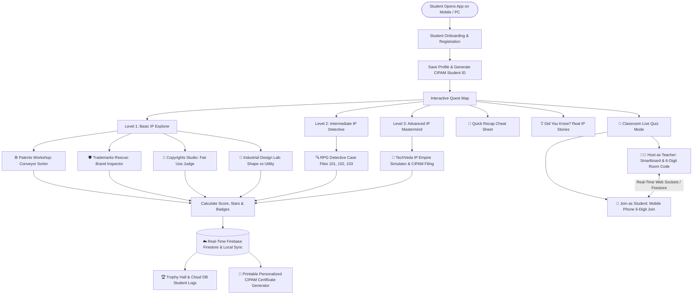

# 🚀 CIPAM IP Quest: Gamified Intellectual Property Awareness for School Students

[](https://sih.gov.in)
[-amber.svg)](https://cipam.gov.in)
[](https://sih.gov.in)
[](#)
[](#)

---

## 📌 Problem Statement Overview (SIH1384)

- **Problem ID**: SIH1384
- **Title**: Developing an interactive gaming software / mobile application on Intellectual Property Awareness for school students.
- **Category**: Smart Education / Software
- **Nodal Ministry / Organization**: Cell for IPR Promotion and Management (CIPAM), Department for Promotion of Industry and Internal Trade (DPIIT), **Ministry of Commerce and Industry, Government of India**.

### 🎯 The Challenge
One of the primary objectives of CIPAM is to create educational tools and resources for **Intellectual Property Rights (IPR)** awareness at the school level. School students learn best when technical areas of law are **gamified, interactive, and visually driven**. Plain text and long legal sentences fail to engage young minds.

### 💡 Our Solution
**CIPAM IP Quest** is an interactive, gamified learning platform that turns complex IPR law into engaging story-driven quests, visual sorting minigames, RPG detective case files, and startup simulation challenges across 3 progression tiers: **Basic, Intermediate, and Advanced**.

Now featuring **Real-Time Database Sync (Firebase Cloud Firestore)** and **Live Mobile Classroom Interaction**!

---

## 🎯 What Problems CIPAM IP Quest Solves

1. **Eliminates Legal Jargon Wall-of-Text**: Replaces legal clauses with interactive conveyor belt sorters, logo inspectors, and RPG courtroom trials.
2. **Covers Core 4 IP Pillars**: Teaches **Patents**, **Trademarks**, **Copyrights**, and **Industrial Designs** with real-world Indian & global examples.
3. **Real-Time Mobile & Classroom Live Utility**: Works for individual student self-paced exploration AND allows school teachers to host live classroom quiz show challenges where students join from their mobile phones.
4. **Instant Recognition & Gamification**: Rewards students with 3-star ratings, earnable trophy badges, and an **Official CIPAM Youth IP Champion Merit Certificate**.
5. **Student Identity & Cloud Logging**: Collects student full name, grade (Class 6-12), school name, state/city, and avatar on initial launch, generating a unique `CIPAM-STU-XXXXX` student ID and syncing scores to Cloud Firestore.
6. **Dual-Role Classroom Live Arena with Real-time DB**: Enables teacher-projector hosting via 6-digit room code generation alongside real-time student mobile participation, live answer syncing, and a real-time smartboard leaderboard.

---

## 🏗️ System Architecture & Workflow

### 🔄 Application Flowchart



---

## 🎮 Core Features & Game Modules

### 1. Three Progression Tiers

#### Tier 1: Basic (IP Explorer)
- ⚙️ **Patents Workshop**: Help young inventor Alex evaluate novel inventions on a high-tech conveyor belt based on **Novelty**, **Inventive Step**, and **Industrial Use**.
- 🛡️ **Brand Guardian Quest**: Spot genuine trademarks vs counterfeit fake products (e.g. *Abibas*, *Pumaa*), and differentiate ™ (pending) from ® (registered).
- 🎨 **Creator's Studio**: Help artist Maya protect digital paintings, music, books, and code. Resolve **Fair Use** vs **Piracy** scenarios.
- 🎨 **Product Design Lab**: Learn how **Industrial Design** registration protects 3D visual aesthetic shape and casing contours without patenting internal technical mechanisms.

#### Tier 2: Intermediate (IP Detective RPG Cases)
- 🔍 **Case #101: Counterfeit Tech Mystery**: Investigate trademark font copying and casing design theft.
- 🎧 **Case #102: The Viral Beat Heist**: Solve music sampling disputes and commercial advertising Fair Use limits.
- 🧪 **Case #103: The Herbal Secret Battle**: Defend Ayurvedic traditional knowledge (Neem & Tulsi) against invalid foreign patent claims using India's **Traditional Knowledge Digital Library (TKDL)**.

#### Tier 3: Advanced (IP Mastermind & Startup Tycoon)
- 🚀 **IP Empire Simulator**: Founder simulator where students manage capital, register trademarks, file patent applications with CIPAM India, license IP, and build a 100% compliant startup portfolio.

---

### 2. Live Classroom Arena & Database Logging

- 👥 **Dual-Role Real-Time Classroom Mode (`ClassroomMode.tsx`)**:
  - **👩‍🏫 Host as Teacher**: Project on smartboard with a 6-digit Room Code. Connected student avatars pop up live on screen as students join from mobile phones.
  - **👦 Join as Student**: Enter 6-digit room code on mobile phone. Answers and scores sync in real time to the teacher's smartboard leaderboard.
- ☁️ **Firebase Cloud Firestore & Local Real-time Sync (`classroomService.ts`)**: Automatically logs student scores, badge unlocks, level completions, and live quiz answers into the database.
- 🏆 **Database Synced Scoreboard (`Scoreboard.tsx`)**: Features a **"☁️ DB Student Logs"** tab for teachers to review logged student progress stored in the database.
- 👤 **Student Identity Onboarding (`OnboardingModal.tsx`)**: Collects student full name, grade (Class 6-12), school name, state/city, and avatar on initial launch, generating a unique student ID (`CIPAM-STU-XXXXX`).
- 📜 **Personalized CIPAM Certificate Generator (`CertificateModal.tsx`)**: Generates an official printable *CIPAM Youth IP Champion Merit Certificate* dynamically populated with student details and score verification ID.
- 🔊 **Web Audio API Sound Synthesis**: Zero-latency built-in audio synthesizer for clicks, correct answers, wrong answers, victory fanfares, and badge unlocks.

---

## 🛠️ Technology Stack

| Layer | Technology Used | Reason for Choice |
| :--- | :--- | :--- |
| **Frontend Framework** | React 19 + Vite + TypeScript | Lightning-fast HMR, component modularity, type safety |
| **Real-Time Database** | Firebase Cloud Firestore + BroadcastChannel | Instant multi-device sync, offline-ready fallback, cloud progress logging |
| **Styling & Design** | Tailwind CSS v4 + Custom Glassmorphism | Vibrant modern gamified theme tailored for school students |
| **Icons & Visuals** | Lucide React + Canvas Confetti | Rich interactive iconography and celebratory victory effects |
| **Audio Engine** | Web Audio API (Native Browser Synthesis) | Zero external audio asset loading latency, works 100% offline |
| **Data Persistence** | Cloud Firestore + LocalStorage API | Automatically saves student profile, progress, unlocked levels, stars, and badges |

---

## ⚡ How to Run & Test on Mobile / PC

### Prerequisites
- Node.js (v18 or higher)
- npm (v9 or higher)

### Steps

1. **Clone or Navigate to Project Directory**:
   ```bash
   cd "c:/Users/Admin/Desktop/try sih 1384"
   ```

2. **Install Dependencies**:
   ```bash
   npm install
   ```

3. **Start Development Server**:
   ```bash
   npm run dev
   ```

4. **Run on Mobile Phone (Same Wi-Fi Network)**:
   - In the terminal, Vite will display your **Network URL**:
     ```text
     ➜  Local:   http://localhost:5173/
     ➜  Network: http://192.168.X.X:5173/
     ```
   - Open Chrome or Safari on your mobile phone and type the **Network** URL (e.g. `http://192.168.1.15:5173`).

5. **Test Classroom Live Sync**:
   - On PC / Smartboard browser: Open **Classroom Mode** -> **Host as Teacher**. Note the 6-digit Code (e.g. `849201`).
   - On Mobile Phone: Open **Classroom Mode** -> **Join as Student**, enter `849201` and student name.
   - Observe real-time student join popups and live leaderboard score updates!

6. **Build for Production**:
   ```bash
   npm run build
   ```

---

## 🚀 Future Roadmap & Impact

- 🌐 **Multilingual Support**: Add Hindi, Tamil, Marathi, Telugu, and Bengali translations to reach 100,000+ Indian schools.
- 📱 **Mobile Native Packaging**: Package as an Android APK using Capacitor / React Native for Google Play Store deployment.
- 📊 **Teacher & School Analytics Dashboard**: Allow school administrators to monitor student completion rates and national IPR awareness benchmarks.

---

## 📄 License & Attribution
Developed for the **Smart India Hackathon (SIH)** under **CIPAM (Ministry of Commerce and Industry, Government of India)**.
